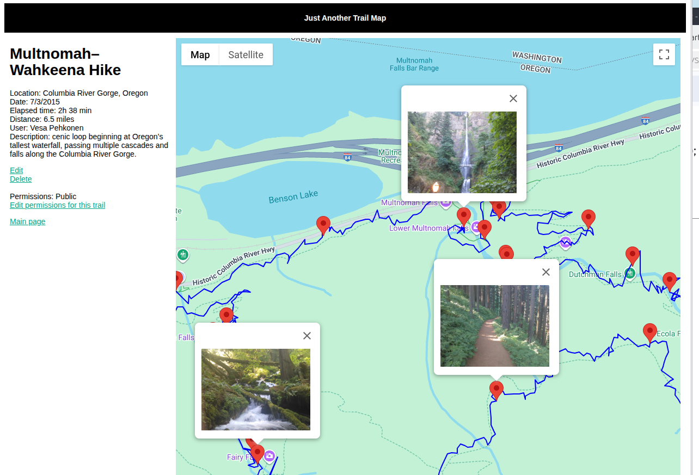

# Just Another Trail Map

Just Another Trail Map is a web and Android application for recording GPS trails and visualizing them with geotagged photos on an interactive map.



---

## Overview

Just Another Trail Map allows users to:

- Record GPS trails using an Android mobile device  
- Capture photos with location metadata  
- Upload trails and photos to a web server  
- View routes and photo points on an interactive map  

The system consists of a Node.js web application and an Android client.

---

## Architecture

### Web Application

The backend provides a JSON REST API and handles trail storage and retrieval.

**Technologies**

- Node.js  
- Express  
- MongoDB  
- Jade (Pug) templates  
- JavaScript / jQuery  
- Google Maps API  

**Project Structure**

```
nodejs/
 ├── routes/   # Controllers and route logic
 ├── views/    # Jade templates
 └── public/   # Client-side scripts and styles
```

---

### Android Application

The Android client records GPS data and photo locations, then uploads them to the server.

**Technologies**

- Java  
- Android Studio  

**Features**

- GPS trail recording  
- Photo geolocation  
- Server synchronization  

---

## Getting Started

Clone the repository:

```bash
git clone https://github.com/vesapehkonen/jatrailmap
```

---

## Running the Web Application

Navigate to the Node.js project:

```bash
cd jatrailmap/nodejs
npm install
npm start
```

---

## Project Status

This project was created as a learning / experimental project and is not actively maintained.

---

## License

This project is licensed under the MIT License. See `LICENSE.txt` for details.

---

## Contributing

Contributions, ideas, and improvements are welcome via issues and pull requests.
