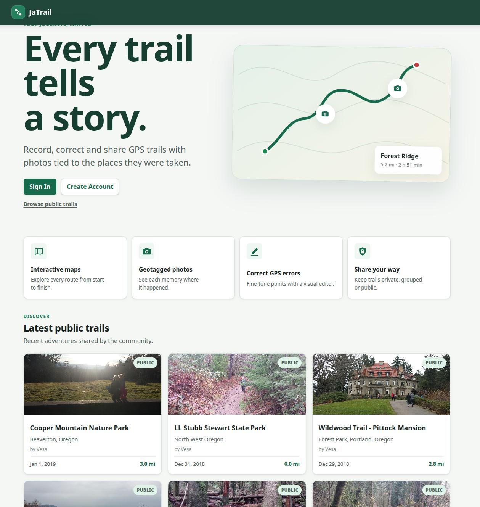

# JaTrail

JaTrail records GPS trails on Android and presents them on a private, group,
or public web map with geotagged photos. Trail owners can correct GPS errors,
move photo locations, choose a main trail photo, and control sharing from a
single editor.

<p align="center">
  
</p>

## Features

- GPS trail recording and geotagged photos on Android
- Multipart trail and photo uploads to a versioned JSON API
- Interactive route maps with start, finish, and photo markers
- Editable GPS points and photo locations with common Save and Cancel actions
- Distance, elapsed-time, and interactive elevation profiles
- Main photos for trail listings and detail pages
- Private, group, and public trail and photo sharing
- Optional public display name and location
- Account, quota, moderation, storage, and registration administration
- Secure password login, server-side sessions, CSRF protection, and centralized
  trail access checks

## Active applications

```text
.
├── fastapi/   FastAPI web application and JSON API
├── android/   Android recording and upload application
└── legacy/    Retired Node.js and Spring servers
```

The active server uses FastAPI, Pydantic, PyMongo, MongoDB, Jinja2, and plain
JavaScript. Photos are stored as BSON binary data in MongoDB. The Android client
uses `POST /api/v1/trails` for multipart uploads.

The applications in `legacy/` are historical migration references. Do not run
them against the current database; see [legacy/README.md](legacy/README.md).

## Requirements

- Python 3.11 or newer
- MongoDB
- Android Studio or a compatible JDK and Android SDK for Android development

## FastAPI setup

Clone the repository and enter the server directory:

```bash
git clone https://github.com/vesapehkonen/jatrail.git
cd jatrail/fastapi
```

Create a virtual environment, install JaTrail, and create local configuration:

```bash
python3 -m venv .venv
.venv/bin/pip install -e '.[test]'
cp .env.example .env
```

Review `.env` before starting the server. In particular, configure the MongoDB
URI, database name, allowed hosts, secure cookies, and upload limits for the
deployment environment.

Start the development server:

```bash
.venv/bin/uvicorn app.main:app --reload
```

The default local address is <http://127.0.0.1:8000>.

### Production container

Build the production FastAPI image from the repository root:

```bash
docker build -t jatrail-web ./fastapi
```

Create a private production environment file from
`fastapi/.env.production.example`. Its MongoDB host must be reachable from the
container; `localhost` inside the container refers to the container itself.
Then start the application:

```bash
docker run --rm --name jatrail-web \
  --env-file fastapi/.env.production \
  -p 8000:8000 \
  jatrail-web
```

The image runs as a non-root user and reports application and MongoDB readiness
at `/health`. MongoDB is not included in this Phase 1 image.

### Docker Compose stack

The Phase 3 stack in `deploy/compose.yaml` runs Caddy, FastAPI, and an
authenticated MongoDB with persistent volumes. Caddy is the only service with
published host ports; FastAPI and MongoDB stay on private Compose networks.
Caddy creates and renews HTTPS certificates automatically.

Follow [deploy/README.md](deploy/README.md) to create local secret and
environment files, configure the public hostname, and start the stack.

### Container publishing

Pushes to `main` that change FastAPI code automatically run the FastAPI tests,
build the production image on a GitHub-hosted runner, and publish it to:

```text
ghcr.io/vesapehkonen/jatrail:<full-git-commit-sha>
ghcr.io/vesapehkonen/jatrail:latest
```

The full commit tag is protected from replacement; `latest` follows the newest
successful build. Android-only and documentation-only pushes do not start the
workflow. The workflow does not deploy to the VPS, create Git tags, or delete
container images.

### Create an administrator

Create the first administrator interactively:

```bash
.venv/bin/python -m app.admin_cli create admin
```

An existing account can be promoted with:

```bash
.venv/bin/python -m app.admin_cli promote USERNAME
```

The administrator dashboard is available at `/admin` after signing in.

### Migrate legacy user profiles

Preview and then apply the idempotent profile migration:

```bash
.venv/bin/python migrate_user_profiles.py --dry-run
.venv/bin/python migrate_user_profiles.py
```

The migration converts the legacy name and location fields while keeping the
migrated public-profile visibility settings disabled.

## Android development

Open `android/` in Android Studio, or run its Gradle wrapper from the repository
root:

```bash
cd android
./gradlew test
./gradlew assembleDebug
```

Configure the JaTrail server URL in the application before uploading to a
non-default environment. The server must expose `POST /api/v1/trails` over
HTTPS outside local development.

## Tests

Run the FastAPI tests:

```bash
cd fastapi
.venv/bin/pytest -q
```

Run the Android unit tests:

```bash
cd android
./gradlew test
```

## Data and security notes

- The current MongoDB database name is `jatrail` unless overridden in `.env`.
- Images are stored as BSON binary data, not Base64 strings.
- Per-user MongoDB quota values override environment defaults.
- Public trail and photo access is always checked on the server.
- `.env`, virtual environments, build products, and local Android configuration
  are intentionally excluded from version control.

## License

JaTrail is licensed under the MIT License. See [LICENSE.txt](LICENSE.txt).
